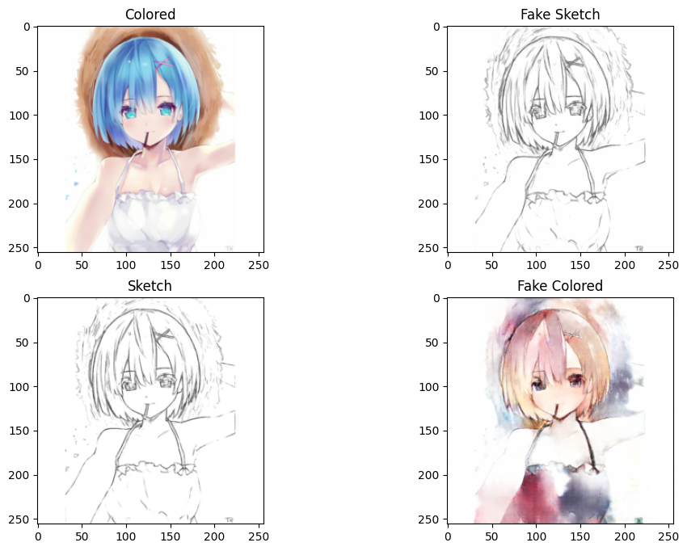

# AnimeGANs
A few notebooks showing CycleGAN and UNet pix2pix approaches for anime sketches colorization + hf demo link

## ***Demo***
There is a Streamlit **[demo](https://huggingface.co/spaces/igor-saprygin/anime-sketch-color-gan)** on hf you can try yourself

## CycleGAN
Was initially implemented for Monet2Photo dataset for which the notebook is also uploaded. The approach implies an unpaired training, hence the generators do not know about the original pictures unlike pix2pix.

Interestingly, CycleGAN tends to use a cold violet/blue pallete on validation data. Maybe it got collapsed during training, though mid-training samples are diverse.

Rem: the first two are from val data, the last are from train

## Pix2pix (UNet)
The next approach leverages  given "answers" and uses UNet as the Generator. The result is apparently more diverse in colors though the general OOD quality of colorings seems lower than of those from CycleGAN. 

